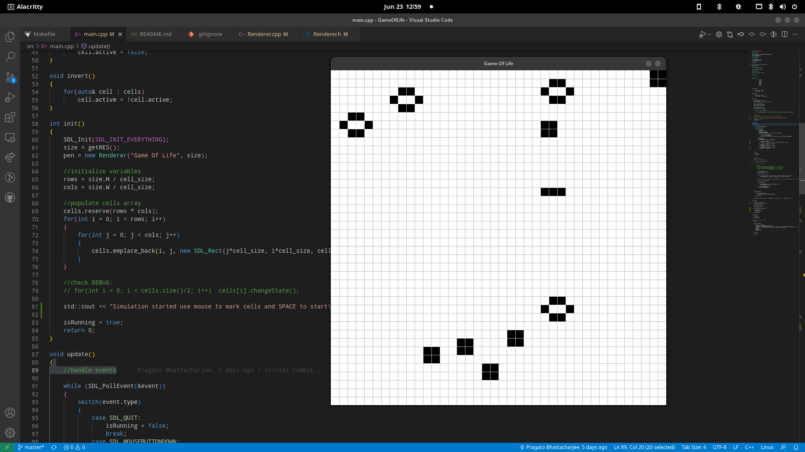

# GameOfLife
Real time interactive simulation of Conway's Game of Life made with c++/sdl2. 
 

 
<a href="https://en.wikipedia.org/wiki/Conway%27s_Game_of_Life">What is Conway's Game of Life?</a>

press `space` to pause and play anytime and use `left-mouse button` to mark/unmark cells.
use `r` for reset, `s` for inverting cell marks and `g` to switch grid view.

## How to run

very minimalist build system

run gnu `make` for building and launching the debug build 

and `runWindows.bat` to run on windows. (make sure you have `gcc`)
